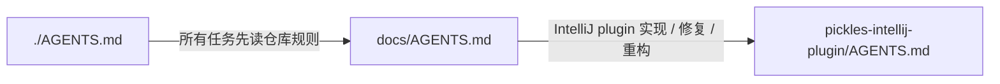

你将基于当前仓库的文档路由规则，自动生成一份“文档路由图”。

该任务必须在没有聊天上下文的情况下完成。你只能依赖当前仓库内的文件内容，不得依赖对话历史、记忆、已有结论或外部资料。

输出文件固定为：

```text
docs/60-human/DOCUMENT-ROUTING-MAP.md
```

生成时覆盖该文件。

禁止输出任何 `docs/60-human/DOCUMENT-ROUTING-MAP.md` 之外的内容。

---

====================
【核心定位】
======

生成的文档是 human 文档，不是 AI 默认加载入口。

它的用途是帮助人类理解、检查和优化当前文档加载网络：

* 某类任务从入口会读到哪些文档
* 某条文档依赖链是否清晰
* 某个文档是否缺少上游加载路径
* `docs/AGENTS.md` 是否存在漏路由、重复路由或过度路由

生成的文档不得把自己写成新的路由规则来源。

必须明确写出：

* 真实加载规则以 `./AGENTS.md`、`docs/AGENTS.md`、模块内 `AGENTS.md` 和具体文档内的直接链接为准
* 本文档只是一张人类阅读的地图
* 本文档不要求 AI 在普通任务中默认读取

---

====================
【读取顺序】
======

必须按以下顺序读取：

1. `./AGENTS.md`
2. `docs/AGENTS.md`
3. `docs/00-governance/DOCUMENT-RULES.md`
4. 从 `docs/AGENTS.md` 的任务路由中识别关键入口文档
5. 只读取关键入口文档中直接链接的下一级文档

关键入口文档至少包括：

* `docs/00-governance/ARCHITECTURE.md`
* `docs/00-governance/TODO-RULES.md`
* `docs/00-governance/DOCUMENT-RULES.md`
* `docs/00-governance/NAMING-AND-PLACEMENT-RULES.md`
* `pickles-intellij-plugin/AGENTS.md`

可以读取 `docs/AGENTS.md` 明确路由到的模块需求文档、接口文档和专项设计文档，用于绘制模块路线图。

禁止全量读取 `docs/` 作为上下文。

---

====================
【生成原则】
======

必须遵守：

* 每条图连线都必须标明“何种情况加载”
* 不画无条件的泛泛引用边，除非它确实是固定入口
* 不把文档目录画成全量索引
* 不重复 `docs/AGENTS.md` 的全文
* 只画关键路径和典型路径
* 重点呈现路由判断，而不是文件清单
* 当发现某条路径只存在于文档内部链接中，必须按“上游文档 -> 直接链接文档”的方式表达
* 当发现某条路径由 `docs/AGENTS.md` 直接触发，必须按“任务信号 -> 文档”的方式表达

生成出的文档必须适合人类维护者 review。

---

====================
【文档结构】
======

生成文档必须使用以下结构：

```markdown
# DOCUMENT ROUTING MAP

## 1. Purpose

## 2. Scope

## 3. Reading Rule

## 4. Entry Map

## 5. Module Route Map

## 6. Governance Route Map

## 7. Plugin And Integration Route Map

## 8. TODO And RUNBOOK Route Map

## 9. Maintenance Checklist

## 10. Open Items
```

`Open Items` 为空时写：

```text
无
```

---

====================
【图格式】
======

必须使用 Mermaid。

每个图使用：

```mermaid
%%{init: {"flowchart": {"defaultRenderer": "elk"}} }%%
flowchart LR
```

节点 label 使用相对 `docs/` 的路径、仓库根路径，或模块路径。

示例：



连线 label 必须是加载条件，不能只写“see”、“link”、“read”。

---

====================
【必须覆盖的路径】
======

至少覆盖以下路径：

1. 仓库入口路径

```text
./AGENTS.md -> docs/AGENTS.md
```

2. 治理入口路径

包括：

* 架构与模块边界
* TODO 协作与任务收口
* 文档规则
* 命名与文件归属

3. 模块路由路径

至少覆盖：

* `pickles-intellij-plugin/`
* `pickles-runtime/`
* `pickles-mcp/`
* `pickles-hooks/`
* `pickles-rules/`

如果模块内存在 `AGENTS.md`，必须表达 `docs/AGENTS.md` 到该模块 `AGENTS.md` 的加载条件。

4. Plugin / Integration 路径

至少覆盖：

* IntelliJ plugin 任务
* runtime 任务
* MCP 任务
* hooks 任务
* rules 任务
* 插件与 runtime / MCP / hooks / rules 的边界

5. TODO / RUNBOOK 路径

至少覆盖：

* `TODO-RULES.md`
* `RUNBOOK-*.md`
* `TODO.md`

---

====================
【一致性检查】
======

生成前必须检查：

* 图中的路径是否真实存在，通配符路径除外
* 图中的加载条件是否能在 `docs/AGENTS.md`、模块内 `AGENTS.md` 或上游文档直接链接中找到依据
* 是否误把 `docs/50-prompts/` 或 `docs/60-human/` 文档放进 AI 默认加载路径
* 是否误把本文档写成正式路由规则

生成后必须检查：

* Mermaid 代码块完整闭合
* 每条边都有 label
* `Open Items` 不为空时必须是可执行的文档治理问题
* 不存在与 `docs/AGENTS.md` 明显冲突的加载路径

---

====================
【禁止事项】
======

禁止：

* 把 `DOCUMENT-ROUTING-MAP.md` 写入 `docs/AGENTS.md` 的默认加载路径
* 生成全量文档目录索引
* 没有加载条件的连线
* 依赖聊天上下文
* 引用外部项目或外部资料
* 把 `docs/50-prompts/` 或 `docs/60-human/` 当作 AI 默认输入目录
* 在最终响应中输出解释、摘要或额外说明
